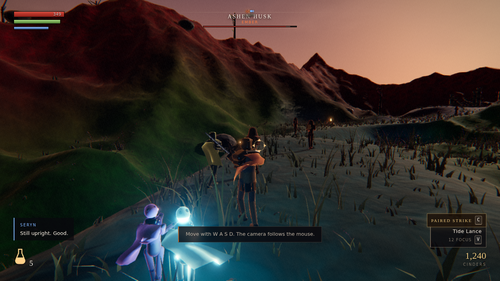

# Emberwake

A third-person action RPG that runs in a browser tab. No install, no plugins,
no build step, and no asset downloads — every texture, sound, character and
piece of architecture in the game is generated at runtime from code.

**Play:** https://nealpathak.github.io/



## What it is

The sun did not set. It **fell** — and shattered into embers scattered across
the Vale. You are Ashbound, sworn to carry them back to the Kindle.

Emberwake takes the parts of four genres that actually combine:

* **Souls-like melee.** Stamina you can run out of, attacks you commit to, a
  dodge with real invincibility frames, poise and stagger, parry into riposte,
  backstabs, and shrines that heal you but wake every enemy in the vale.
* **A party that fights with you.** Companions and summoned spirits take
  standing orders, pull aggro when they are closer than you are, and grow
  support bonds from fighting at your side.
* **An affinity triangle with teeth.** Ember beats Bloom beats Tide beats
  Ember; Radiance and Void tear each other apart. ±35% damage and ±50% poise
  damage is enough to change how you fight something.
* **Spirits worth collecting.** Weaken an elite spirit below a third of its
  health, throw an Ember Sigil, and it joins your covenant — levelling,
  learning moves, and eventually becoming something else.

Die and you drop every cinder you were carrying where you fell. Get back to it
without dying again and it is yours.

## Controls

| | |
|---|---|
| Move | `W` `A` `S` `D` |
| Camera | mouse — click the page to capture the pointer, `Esc` releases it |
| Dodge / sprint | `Space` — tap to roll, hold to sprint |
| Light attack | left mouse (chains three times) |
| Heavy attack | `Shift` + left mouse |
| Guard | right mouse (hold) |
| Parry | `Shift` + right mouse, or `F` |
| Riposte / backstab | `E`, after a parry or from behind |
| Lock on | `Q` · `Tab` cycles targets |
| Heal | `R` |
| Interact | `E` |
| Throw an Ember Sigil | `G` |
| Wisp skill | `V` — `1` / `2` cycle which one |
| Paired Strike / party orders | `C` |
| Menus | `I` inventory · `P` covenant · `M` map · `Esc` pause |

A gamepad is picked up automatically.

## Running it locally

There is nothing to compile.

```sh
python3 -m http.server 4174
# open http://localhost:4174
```

## How it is built

Roughly fifteen thousand lines of hand-written ES modules, plus Three.js
vendored under `vendor/`. Some of the choices worth knowing about:

**Nothing is downloaded.** Every surface texture is fBm noise rendered into a
canvas at boot and turned into albedo, normal and roughness maps. Every
character is assembled from tapered capsules and rounded plates parented to a
22-bone skeleton, then baked into a skinned mesh. Every sound is built from
oscillators and filtered noise at play time, which is why a hit can be pitched
by how hard it landed rather than picking between three samples.

**The terrain is shaped, not generated.** A zone declares ridges, plateaus,
basins, pools, escarpments and a walkable path with explicit heights; the noise
only fills in between them. Reading the shaper list top to bottom is reading the
level.

**Water is terrain you can be slowed by.** One plane per zone: analytic swell in
the vertex shader whose derivatives give the normal exactly, a scrolled ripple
normal map for the chop, and a signed depth map baked from the ground underneath
that decides colour, opacity, roughness, the foam line and the waterline. How
deep you are in it is measured every tick and drags on how fast you move, which
is what makes the dry aisles of a flooded cathedral worth fighting for.

**Animation is authored as data.** Clips are bone names mapped to keyframes in
degrees, compiled to quaternions once and sampled with smoothstep easing, so a
walk cycle reads from four keys. Clips carry events, which is how hitboxes
open and close — retiming an attack is an animation change, not a code change.

**Combat is measured, not assumed.** Hitboxes are swept and subdivided by how
far the blade actually moved between samples, so a hit lands on a struggling
machine as well as a fast one. Balance is measured too: a bot plays each
encounter through the real input layer and reports whether the fight was
actually winnable. It has found more real bugs than reading the code did.

**Fog has a height term.** Three's built-in fog is distance-only, which makes a
valley floor and the ridgeline above it the same colour. The global fog chunks
are overridden to integrate an exponentially decaying density along the view
ray, with sun inscatter.

## Repository layout

```
index.html          the whole game entry point
src/core/           loop, input, math, RNG, events, settings, save
src/render/         renderer, post FX, procedural textures, materials, sky, fog, VFX
src/anim/           skeleton, keyframe clips, layered animator, the clip library
src/world/          terrain, collision, props, foliage, zone assembly
src/actors/         player, enemies, bosses, allies, bodies, weapons
src/combat/         stats, affinity, damage, hitboxes, status
src/game/           game shell, camera, lock-on, progression, inventory, covenant
src/ui/             HUD, menus, coaching (DOM, not WebGL)
src/audio/          procedural synthesis and adaptive music
src/data/           zones, enemies, items, wisps, companions
vendor/three/       Three.js, MIT, vendored so there is no CDN dependency
docs/DESIGN.md      the design document
tools/              parse check, headless harness, test suite
```

## Development

```sh
tools/check.sh              # parse-check every module
tools/test.sh               # the test suite (see below)
tools/shot.sh out.png 2000  # headless render, console errors, perf numbers
```

`tools/test.sh` has no test framework. Each script under `tools/tests/` is
evaluated inside a real page with the game running, after the render loop has
been taken off `requestAnimationFrame` and driven by hand at a steady 60Hz.
Combat, progression, the party and the boss are exercised against the actual
game, deterministically, in a couple of seconds, without depending on how fast
the machine can draw. Every non-trivial bug in this project was found that way.

Useful query parameters: `?autostart=1` skips the title card, `?zone=choir`
opens the second zone directly, `?studio=1` swaps the zone's art direction for
neutral lighting, `?clip=attackHeavy1` opens the animation lab.

## Licence

Game code is MIT. Three.js is vendored under `vendor/three/` with its own MIT
licence.
